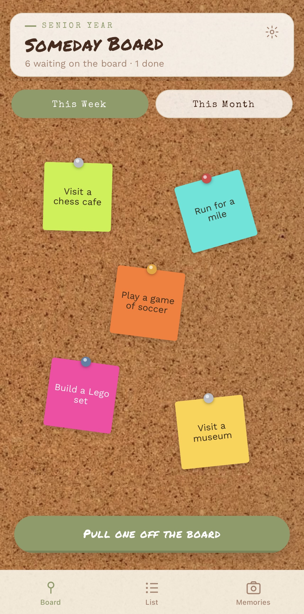

# Someday Board

A native iOS scrapbook wall for the things you keep putting off: pin items up, pull one off the board each week or month as a timed challenge, and turn it into a photo memory once it's done.

**Status:** personal-use app, distributed to a small group via TestFlight (not on the public App Store).



---

## Why Someday Board?

Bucket-list apps tend to be either a flat todo list or an over-gamified habit tracker. This is neither — it's meant to feel like a corkboard on your wall:

- **Pin items to a corkboard**, positioned and rotated by hand like real scrap paper pinned with a pushpin, not a list row
- **Week and month "boards"** — items belong to a track, and pulling one off the board claims it as that track's timed challenge, with a real wind-up animation for the moment of picking
- **Photo memories** — log a note, a rating, and a photo once a challenge is done; completed items leave the board entirely and live on in a Memories grid, sorted by when they were actually finished
- **Sign in with Apple** — one tap, no accounts or passwords to manage

## Architecture

- **Frontend:** Expo (managed) + React Native + TypeScript, Expo Router for file-based navigation across the Board/List/Memories tabs
- **State:** Zustand
- **Backend:** Supabase (Postgres, Auth, Storage) — Row-Level Security scoped to `auth.uid()` on every row, and storage objects live under a uid-prefixed path enforced by policy, not just convention
- **Gestures/animation:** React Native Reanimated + Gesture Handler drive drag-to-reposition, two-finger rotate, and the multi-phase "pull one off the board" sequence
- **Auth:** Sign in with Apple via `expo-apple-authentication` — the native flow (Face ID, no browser redirect), verified server-side through Supabase's `signInWithIdToken`
- **Distribution:** EAS Build/Submit → TestFlight, entirely from Windows with no Mac anywhere in the pipeline. A monthly GitHub Actions workflow ([`.github/workflows/testflight-refresh.yml`](.github/workflows/testflight-refresh.yml)) rebuilds and resubmits automatically so the build never quietly expires (TestFlight builds expire ~90 days after submission)

## Tech Stack

Expo · React Native · TypeScript · Expo Router · Zustand · Supabase (Postgres, RLS, Auth, Storage) · React Native Reanimated · React Native Gesture Handler · expo-apple-authentication · EAS Build/Submit · GitHub Actions

(An earlier version of this project was a vanilla HTML/CSS/JS PWA with no backend. It's been fully replaced by the app described here; its history is still in git if you want to look back at it.)

## Getting Started

**Requirements:** Node.js, npm, a Supabase project, and an iPhone with Expo Go installed for local dev. No Mac or Xcode needed.

**1. Create the Supabase project.** At [supabase.com](https://supabase.com), create a new project.

**2. Run the schema.** In the Supabase dashboard's SQL Editor, run everything in [`mobile/supabase/schema.sql`](mobile/supabase/schema.sql) — it creates the `items`/`memories` tables, enables row-level security scoped to `auth.uid()`, and creates the private `memory-photos` storage bucket with matching policies.

**3. Add your Supabase credentials.**

```bash
cd mobile
cp .env.example .env
```

Fill in `EXPO_PUBLIC_SUPABASE_URL` and `EXPO_PUBLIC_SUPABASE_ANON_KEY` from your project's Settings → API page.

**4. Turn on Sign in with Apple.** Two places:

- **Apple Developer portal** → Certificates, Identifiers & Profiles → Identifiers → your app's App ID → enable the "Sign In with Apple" capability.
- **Supabase dashboard** → Authentication → Providers → Apple → enable it, and register your app's bundle identifier (e.g. `com.yourname.somedayboard`) as an authorized client ID. This is the *native* flow (no Services ID or redirect URL needed) — the app gets a signed identity token straight from Apple's SDK and hands it to Supabase.

**5. Install dependencies and start the dev server.**

```bash
cd mobile
npm install
npx expo start
```

Scan the QR code with your iPhone's camera (opens in Expo Go — install it from the App Store first).

## Building for TestFlight

Distributable builds go through EAS Build/Submit ([`mobile/eas.json`](mobile/eas.json)):

```bash
cd mobile
npx eas-cli build --platform ios --profile production
npx eas-cli submit --platform ios --profile production --latest
```

This requires a paid Apple Developer account. Any change to native config (`app.json` plugins/entitlements) needs a fresh build — a JS-only change doesn't.

### Keeping EAS Build in sync with local `.env`

`.env` is gitignored and lives only on your machine, so a locally-triggered `eas build` picks it up automatically. A build triggered elsewhere — like the GitHub Actions workflow above — starts from a clean git checkout with **no `.env` at all**. If the Supabase URL/key aren't *also* registered as EAS's own server-side environment variables, that build silently compiles with `undefined` credentials and crashes on launch with no useful log anywhere. Keep both in sync whenever the Supabase project's URL or anon key changes:

```bash
npx eas-cli env:set production --name EXPO_PUBLIC_SUPABASE_URL --value "..."
npx eas-cli env:set production --name EXPO_PUBLIC_SUPABASE_ANON_KEY --value "..."
```

Check what's currently registered with `npx eas-cli env:list production`.

## How auth works here

Sign in with Apple, using Apple's native sign-in flow (`expo-apple-authentication`) rather than a web/OAuth redirect — one tap, Face ID, no email or code to type (see `mobile/src/lib/auth.ts`). This only works in a real build (Expo Go can't hold the Apple Sign In entitlement), which is part of why this project moved off Expo Go and onto TestFlight. Sessions persist across restarts via `AsyncStorage` and refresh automatically while the app is foregrounded (see `mobile/src/lib/supabase.ts`).

An earlier version used a typed-in 6-digit email code instead, specifically to route around Expo Go's cold-start deep-linking limitation. That's moot now that the app runs as a real build instead of through Expo Go — and Supabase's built-in email sender turned out to be rate-limited/dev-only anyway, unreliable for delivering codes to more than one address.

## Project layout

- `mobile/src/app/` — Expo Router screens: `(auth)/index.tsx` (sign-in), `(tabs)/index.tsx` (Board), `(tabs)/list.tsx`, `(tabs)/memories.tsx`.
- `mobile/src/components/board/` — the corkboard: drag-to-reposition, the "pull one off the board" animation, the challenge ticket.
- `mobile/src/components/memories/` — the memory-logging modal, the memories grid card, and the detail view.
- `mobile/src/lib/` — Supabase client, auth helpers, and photo upload/signed-URL helpers.
- `mobile/src/store/` — Zustand stores for auth session and board state.
- `mobile/supabase/schema.sql` — the database schema to run once per project.
- `.github/workflows/testflight-refresh.yml` — the monthly auto-rebuild/resubmit job.

## Notes

- This is built for personal, single-user use — RLS scopes every row to your own `auth.uid()`, but there's no multi-tenant UI beyond that.
- Photos are resized/compressed client-side (max 640px, JPEG ~0.6 quality) before upload.
- **This project is intentionally pinned to Expo SDK 54, not latest.** SDK 57's Expo Go build was stuck in Apple App Store review with no ETA, so the project was downgraded to SDK 54 (what the public Expo Go app actually runs) to keep testing on a real iPhone without a paid Apple Developer account. Before upgrading, check whether Expo Go's App Store build has caught up.

## Author

Built by [Christopher Ridad](https://linkedin.com/in/christopher-ridad).
